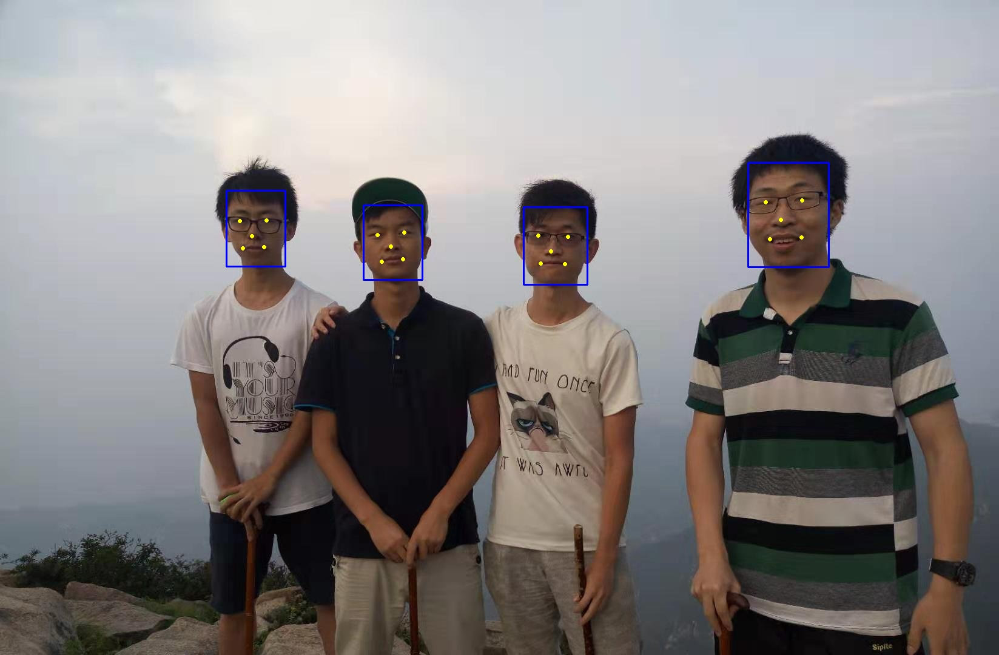
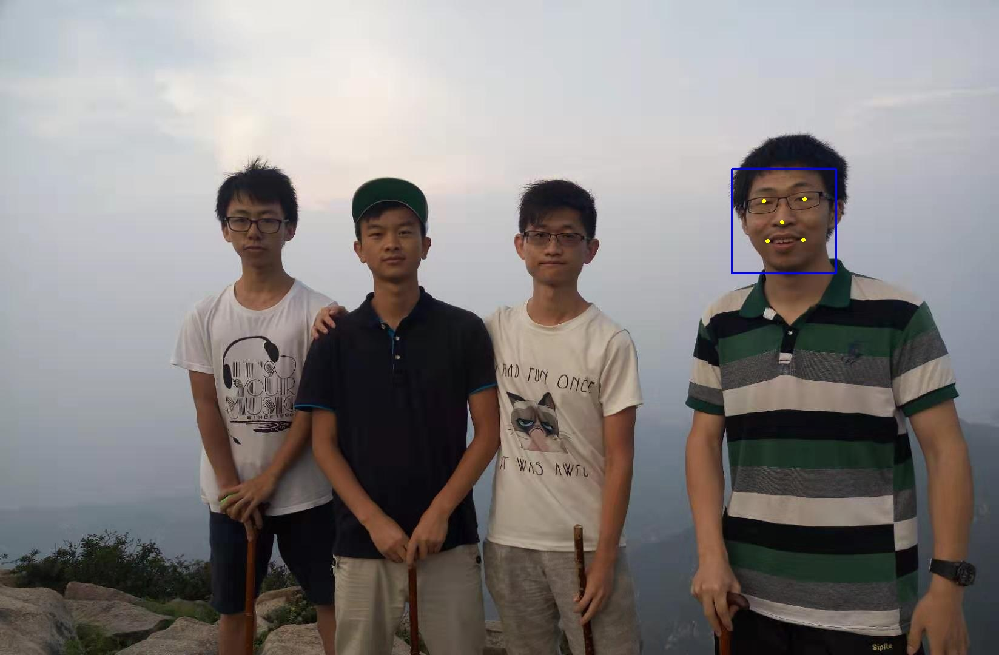

# ncnnpy
This project can easily test the ncnn model and even deploy ncnn projects on python to speed up.
At present, we have implemented face detection and recognition based on ncnn and boost.
face detection has two implementation methods, getting max face by mtcnn and getting all faces by retinaface. 
face recognition by insightface mobilefacenet.In the future, model transformation and debugging will be implemented in it.


### Use directly
We have compiled ncnn with avx2 and ncnnpy, you can download from Baidu Driver  
https://pan.baidu.com/s/1JuhkH7qiuK1fCswckrXzcg code:hpvg
just put ncnnpy.so to ./install and run
```buildoutcfg
python face_detector.py
python face_recognition.py
```
Retinaface for detection all faces  


MTCNN for detection max face  



### Recompile
if you want change code by yourself,you should recompile!  
Review CMakeList.txt and change your python path 
```
if (NOT PYTHON_INCLUDE_DIRS OR NOT PYTHON_LIBRARY)
    SET(PYTHON_INCLUDE_DIRS "/usr/include/python2.7")
    SET(PYTHON_LIBRARY "/usr/lib/python2.7/config-x86_64-linux-gnu/libpython2.7.so")
endif()
```
Review ./cmake/boost-python.cmake and change your boost path 
```buildoutcfg
    set(Boost_LIBRARY_DIRS /usr/local/lib)
    set(BOOST_INCLUDEDIR /usr/include/boost)
```
Than start compling !
```buildoutcfg
git clone https://github.com/hanson-young/ncnnpy.git
cd ncnnpy 
mkdir build
mkdir src/lib
# copy libncnn.a to ./src/lib
cd build && cmake ..

# ncnnpy. so will be generated under this folder
cp ncnnpy.so ./../install
cd ../install
# only python2.7
python face_detector.py
python face_recognition.py
```


- [x] face detection by mtcnn and retinaface
- [x] face recognition by mobilefacenet
- [x] python2.7 


### TODO
- [ ] benchmark 
- [ ] Intermediate output 
- [ ] python3.6 

### Dependencies
Currently only Linux and python2.7 is supported, if you want to run it on Windows or Mac,
I suggest you modify CMakeLists. txt to recompile the source code
```buildoutcfg
$ sudo apt-get install libboost-python-dev libopencv-dev
```
### License
BSD 3 Clause

### Acknowledgement
- [ncnn](https://github.com/Tencent/ncnn)
- [RetinaFace-Cpp](https://github.com/Charrin/RetinaFace-Cpp)
- [insightface](https://github.com/deepinsight/insightface)
- [mobileFacenet-ncnn](https://github.com/honghuCode/mobileFacenet-ncnn/tree/feature/mobilefacenet-mxnet2caffe)
- [numpy-opencv-converter](https://github.com/spillai/numpy-opencv-converter)
